This originally started as a [thread](https://twitter.com/dcuthbert/status/1343194023301947393) for [@Matt_Gerlach](https://twitter.com/Matt_Gerlach) on how one could better work with data collected from pihole. It turned out to be pretty popular, which took me by surprise as I wrongly assumed a lot of people knew how to do this. 

*Never assume! *

So here it is in a better format for those who want to better understand how pervasive the global tracking world is and to do something about it. 

First up, adblockers do not work anymore. What I mean by this is that how we consume the web has drastically changed in recent years. If we think about this in terms of legacy devices (your computer, a traditional browser) versus a mobile device and mobile browser. Now sure, the latter is very similar to a traditional browser but the plugin aspect is the key differentiator here. What I've found, and this is my personal experience, traditional adblockers don't work as well as they should do. In addition, the industry has moved on a lot (they use the same ones you do, don't kid yourself that this industry isn't blackhat af and do dodgy thing). What we need is a new approach to blocking pervasive trackers. 

It's better to cut the snake's head off rather than make it dance to your beat. 

Tools you need:

* [Pi-hole.net](https://pi-hole.net/)
* A Raspberry pi (any will do, just needs some kind of network interface be it ethernet or wireless)
* Some blocklists (you can use mine to start in this repo)

Now the best thing is to create a baseline of what you browse over a period of time. I usually say 30 days as this gives you a nice spread.

Once you've done that, your DB will look pretty cool. You've got two key things here: a web interface

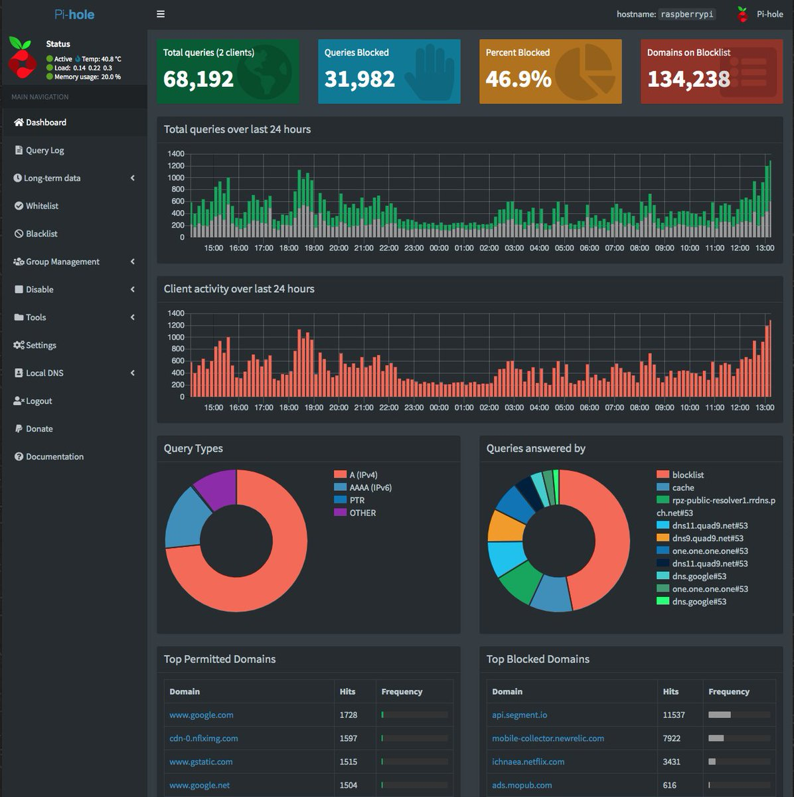

Or the source of that, which is an SQLite3 database, found at */etc/pihole/pihole-FTL.db*

So first you want to back that up and get it onto a box where you can manipulate it

`sqlite3 /etc/pihole/pihole-FTL.db ".backup /home/pi/pihole-FTL.db.backup"` 

Once you've got that, I'd recommend using [DB Browser for SQLite](https://sqlitebrowser.org/). It should look like so
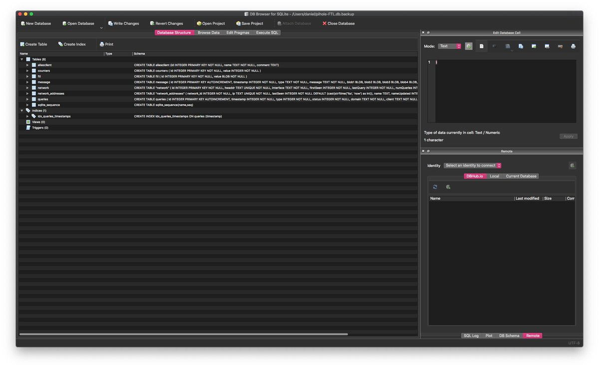

The key tables you want are:

\- network_addresses (where all the queries come from if you have a wide network with numerous sources)
\- queries (the most important table)

Now the latter will be large and this could prove problematic, so you could prune this a little.

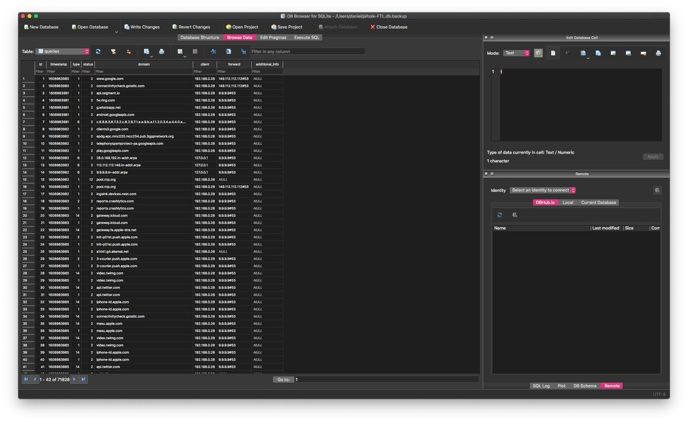

Now you can do all of this via the web UI and it's very good but you could also use the command line. Say I wanted to see all requests from one of my APs

`SELECT DISTINCT domain FROM queries WHERE client IS "192.168.0.28"`

For more info on the table structure, see 

[docs.pi-hole.net/database/ftl/](https://docs.pi-hole.net/database/ftl/)

If you just wanted to show all blocked queries (status 1) then

`SELECT DISTINCT domain FROM queries WHERE status is 1`

then export this as CSV and use something like

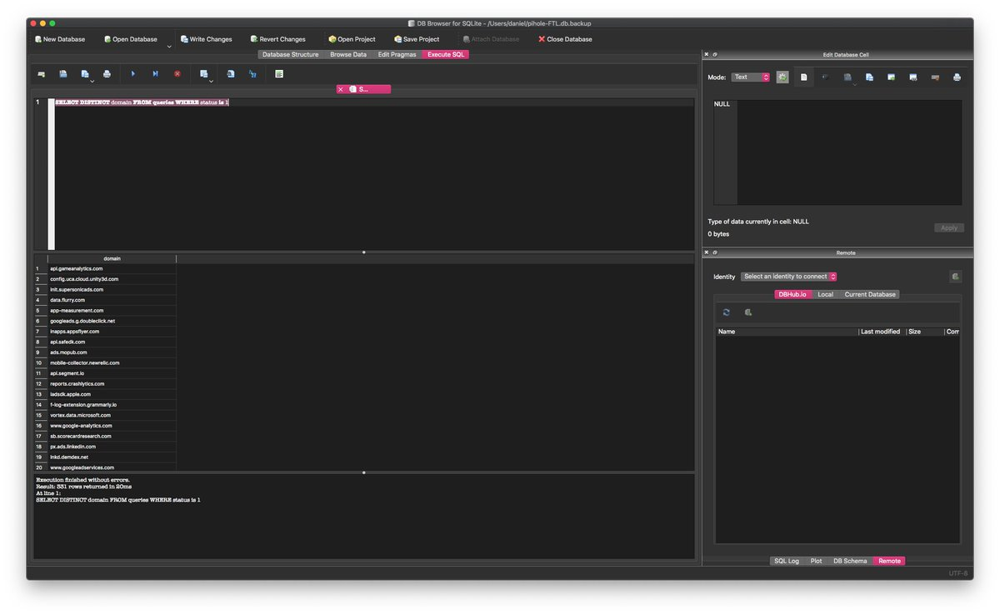

The pi-hole database isn't overly complex and this is great as it allows us to use SQLite queries to start to look for better stats to visualise. For example,

`SELECT domain,count(domain) FROM queries WHERE (STATUS == 2 OR STATUS == 3) GROUP BY domain ORDER BY count(domain) DESC LIMIT 3`

This will return the top three domains that were accepted

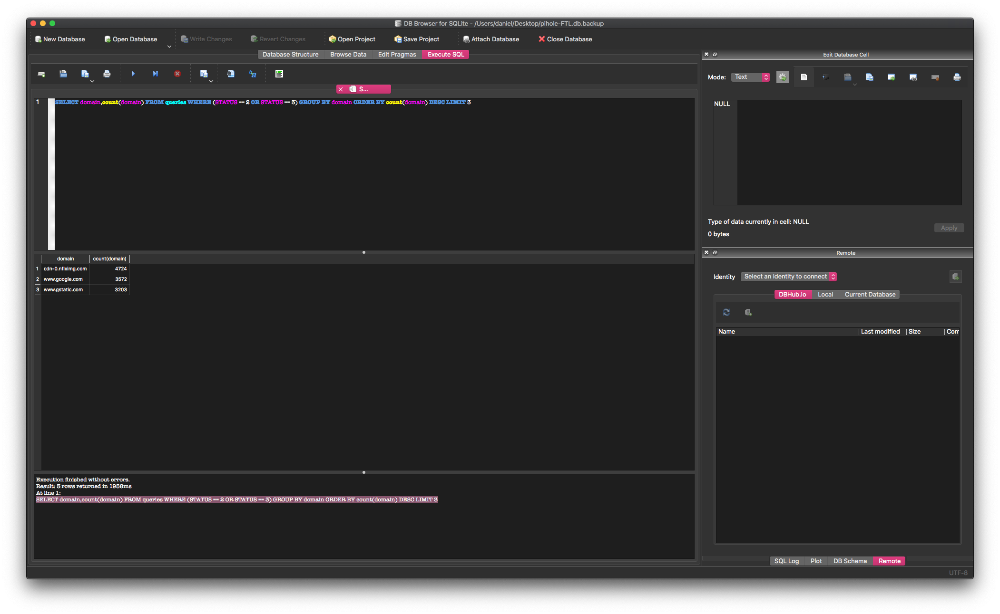

I guess at this point it's important to explain the status codes. 

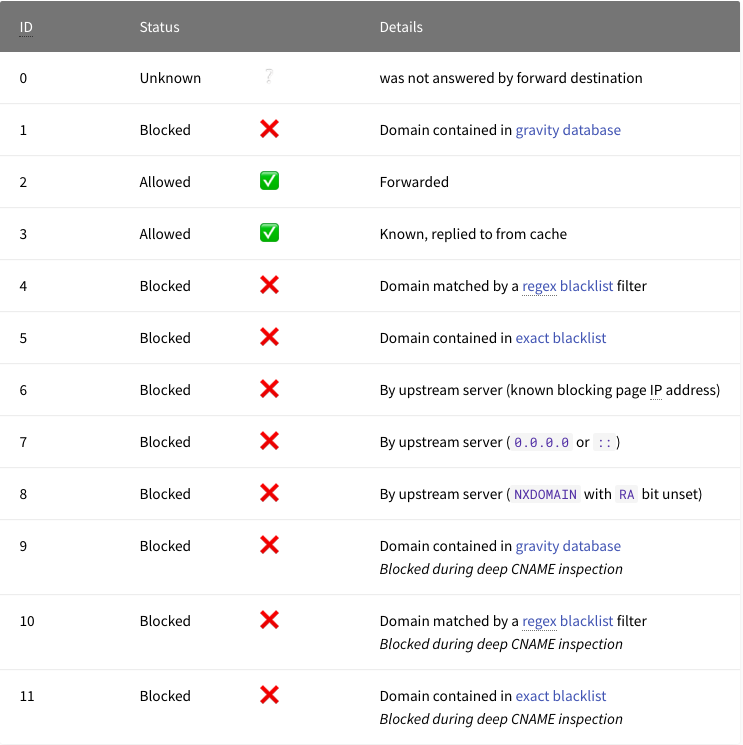

As you can see above, 2 and 3 are the ones you let out of your network, but what about the ugly ones, the blocked ones?

Let's say I want to see which domains are blocked and show me the top 20 of those domains. That would be status ID 1

`SELECT domain,count(domain) FROM queries WHERE (STATUS == 1) GROUP BY domain ORDER BY count(domain) DESC LIMIT 20`

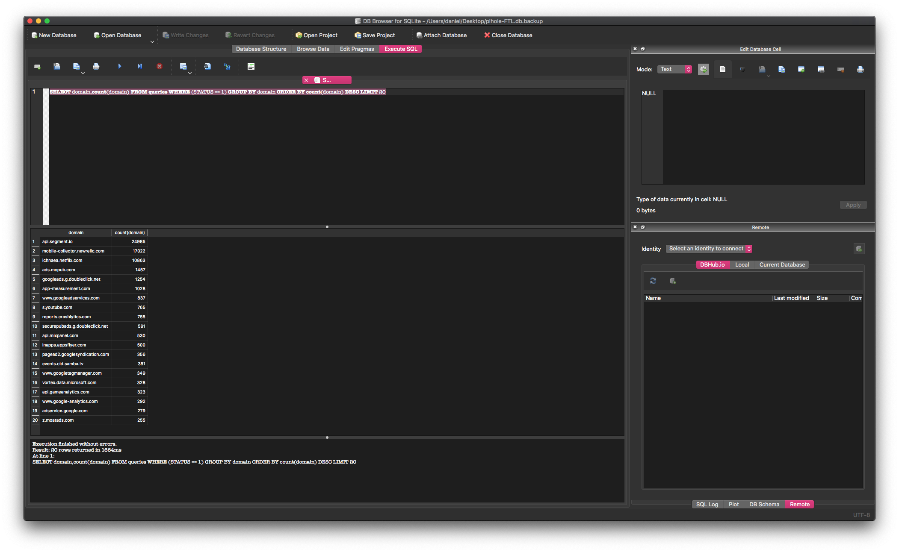

### Visualising Data

Now this is where you'd work out what you want from visualisation. Using our above query for top 20 domains, we export that as a CSV file and use rawgraphs.io. You can choose what you want here but I recommend the pie graph to show the most popular domains being blocked

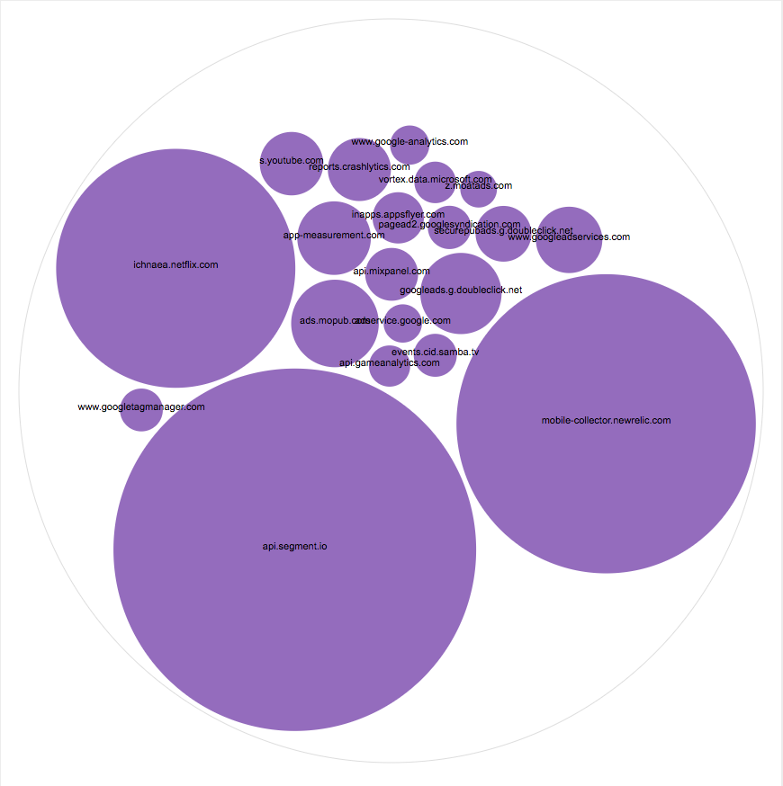

[@snkhan](https://twitter.com/snkhan)recommended https://datasette.io/ and this looks pretty cool, so ill experiment with this and report back. 

For most, the pihole UI is very good so i'd recommend using that at first and fine-turning your block lists based off your own baseline. 

### Creating Blocklists

Now creating blocklists. There's many a way you can do this, you can use ones already made by people or you can explore it yourself. The latter is one approach I prefer.

Let's take a traditional web app, say a dirty ugly news website

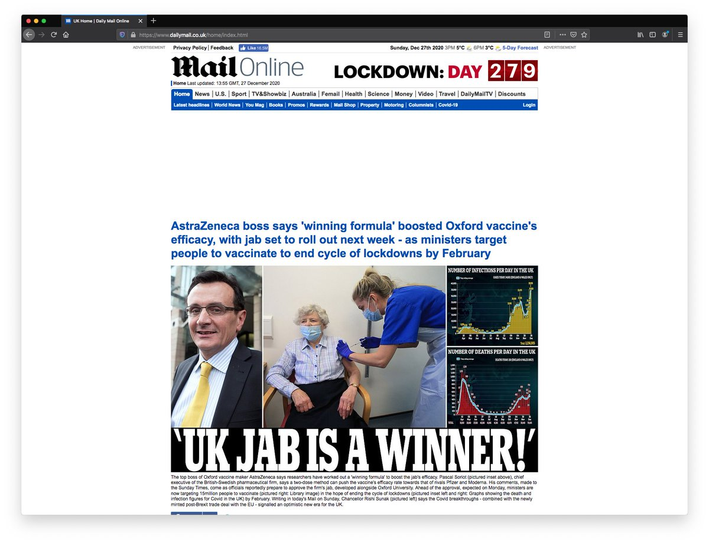

Developer tools are your friend here. What you want to do is inspect every single element, such as what is being loaded (JavaScript), endpoints being called etc.

Turn on developer tools (found in the menu of the browser)

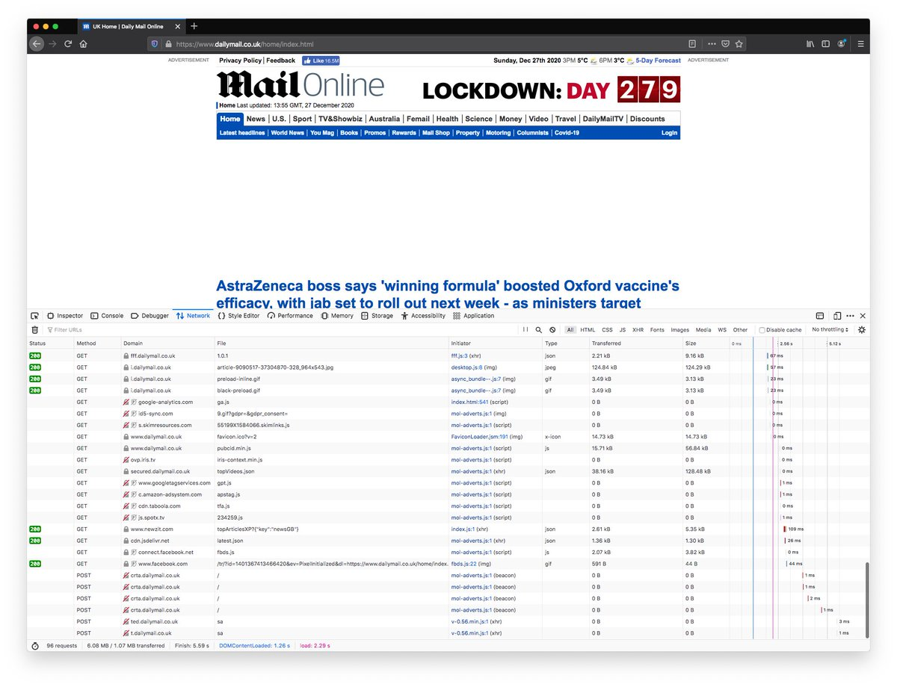

Here's one for adverts called by mol-adverts.js via XHR. So we don't like this, so adding it to our own block list.
Basically, rinse and repeat is the name of the game here.

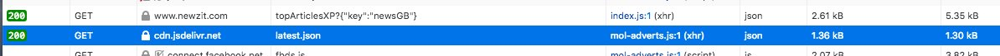
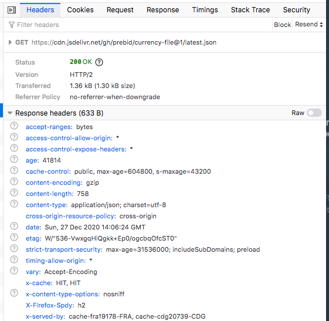

But what happens if you have a mobile app? How do you do the same?

With iOS you can attach a remote developer tool session via safari but it's a hassle, what I prefer doing is pulling down the mobile app and then running it through [MobSF](https://github.com/MobSF/Mobile-Security-Framework-MobSF)

Basically, [MobSF](https://github.com/MobSF/Mobile-Security-Framework-MobSF) is an all-in-one automated mobile application pen-testing framework. Yes, mostly for those looking for vulnerabilities or bugs but also something you can use to find out what that app is doing. 

You need a few things here:

1: Docker (think of this as a platform for creating and running containerised applications)
2: MobSF image

Once you have it installed, go to your terminal and issue this

`docker pull opensecurity/mobile-security-framework-mobsf`

this will pull down the latest version of MobSF. 

The next thing you'll need is the mobile app file in question. For Google it will be an APK and for ios an IPA.

You can use [ipa.rocks](https://ipa.rocks/) and [apkpure.com/app](https://apkpure.com/app)

Just add the name and pull it down 

**Word of caution: this stage is a little bit advanced and can be very daunting to those who aren't familiar with it. But, ask questions and experiment, you can't cut yourself or blow stuff up.** 

The command you want to run is this

`docker run -it -p 8000:8000 opensecurity/mobile-security-framework-mobsf`

basically tells it to run it, listen on port 8000 and use the latest image you pulled above. 

If all went well, you should see this in the terminal and when you visit http://0.0.0.0:8000, you should see

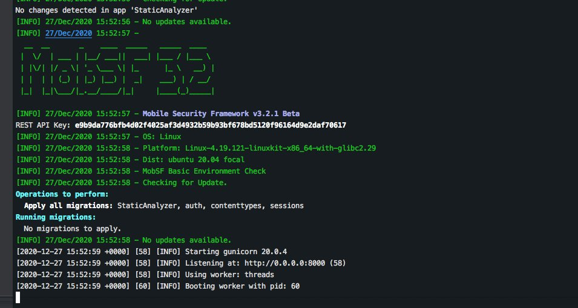
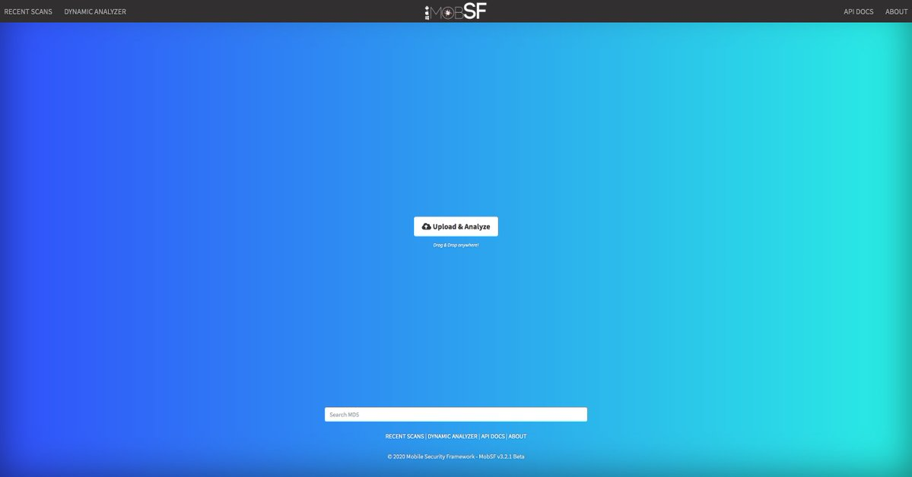

Ok so what exactly are we looking for here? am I hacking? do I get to wear a hoody and have chains on my keyboard?

Not exactly, you are peeking behind the curtains to see what this application is doing. The bits we are interested in are endpoints (servers that the app chats to) 

So we drag our apk or ipa onto the file and let MobSF do its magic.

Remember we are looking for trackers here. Trackers are basically services that monitor what you do.

Now this will take around 10 minutes to work. I do this for every single app my kids use. I don't want to stop them from using the apps but I do want to understand how that app was developed, who it speaks to, what it collects and so on. 

Once it is done, you will be presented with a screen like so. This is a lot of information to handle, so ignore most of it and got to the left and look for reconnaissance and click trackers

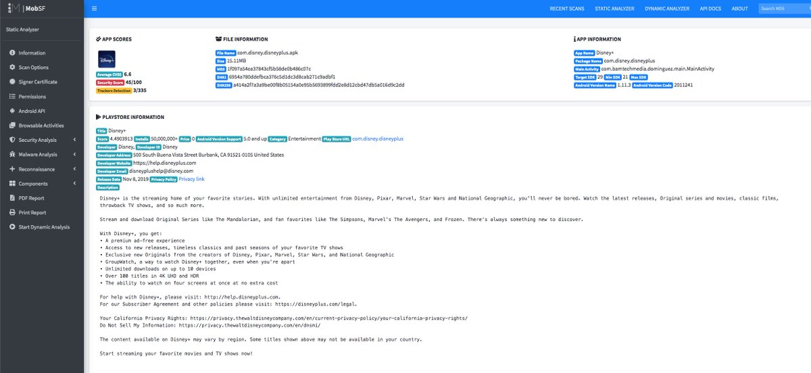
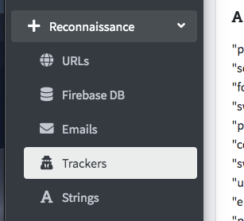

Here we have three that are of some concern:

* braze
* conviva
* google firebase.

The top two are well-used and track a lot. For example

.jpeg)
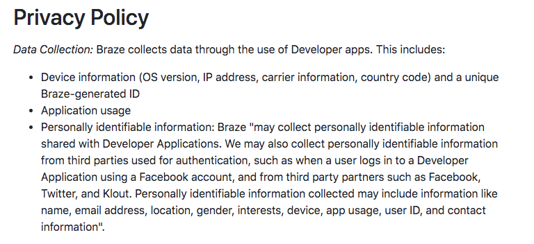

Now the cool thing is that you can see the endpoints in use here:

* appboy.com
* cws.conviva.com
* braze.com
* firebase.google.com

Once you have these, head on over to your pi

group management --> domains

Add each of these into the field and make sure you tick "Add domain as wildcard"

Congrats, you've just stopped the app from being able to call home. Now, this might seem rather longwinded and indeed complex but sadly stopping tracking is a cat and mouse game.

Hope this helps someone. As always, ask questions!! 